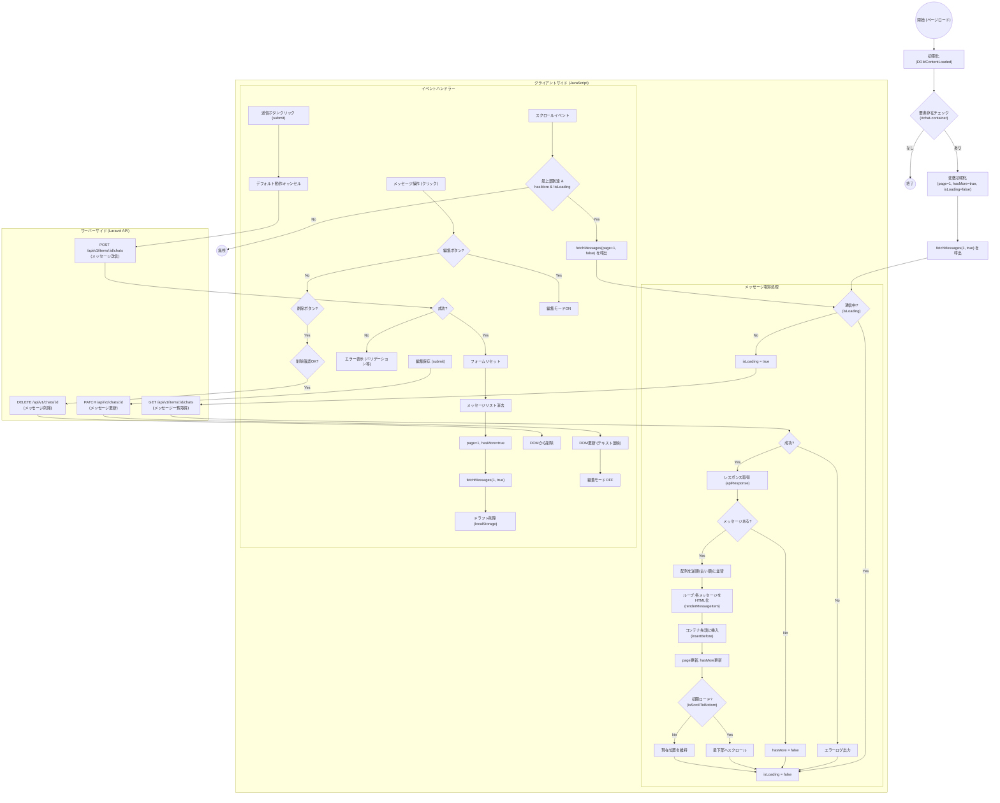

# Chat Feature Logic Flow

```mermaid
flowchart TD
    %% ノード定義
    Start(("開始 (ページロード)"))
    Init["初期化 (DOMContentLoaded)"]
    CheckElements{"要素存在チェック<br>(#chat-container)"}
    InitVars["変数初期化<br>(page=1, hasMore=true, isLoading=false)"]
    CallFetchInit["fetchMessages(1, true) を呼出"]

    subgraph Client ["クライアントサイド (JavaScript)"]
        subgraph FetchLogic ["メッセージ取得処理"]
            IsLoading{"通信中?<br>(isLoading)"}
            SetLoading["isLoading = true"]
            Success{"成功?"}
            ParseData["レスポンス取得 (apiResponse)"]
            HasMessages{"メッセージある?"}
            SetNoMore["hasMore = false"]
            Reverse["配列を逆順(古い順)に並替"]
            RenderLoop["ループ:各メッセージをHTML化<br>(renderMessageItem)"]
            Prepend["コンテナ先頭に挿入<br>(insertBefore)"]
            UpdateVars["page更新, hasMore更新"]
            AdjustScroll{"初期ロード?<br>(isScrollToBottom)"}
            ScrollBottom["最下部へスクロール"]
            ScrollMaintain["現在位置を維持"]
            ErrorGet["エラーログ出力"]
            EndFetch["isLoading = false"]
        end

        subgraph EventLogic ["イベントハンドラー"]
            EventScroll["スクロールイベント"]
            CheckScroll{"最上部到達 &<br>hasMore & !isLoading"}
            CallFetchNext["fetchMessages(page+1, false) を呼出"]

            EventSubmit["送信ボタンクリック (submit)"]
            PreventDefault["デフォルト動作キャンセル"]
            PostSuccess{"成功?"}
            ResetForm["フォームリセット"]
            ClearMsg["メッセージリスト消去"]
            ResetVars["page=1, hasMore=true"]
            Reload["fetchMessages(1, true)"]
            ClearStorage["ドラフト削除 (localStorage)"]
            HandleError["エラー表示 (バリデーション等)"]

            EventClick["メッセージ操作 (クリック)"]
            EditClick{"編集ボタン?"}
            DeleteClick{"削除ボタン?"}
            EditToggle["編集モードON"]
            ConfirmDelete{"削除確認OK?"}
            RemoveDOM["DOMから削除"]

            EventUpdate["編集保存 (submit)"]
            UpdateDOM["DOM更新 (テキスト反映)"]
            EditOff["編集モードOFF"]
        end
    end

    subgraph Server ["サーバーサイド (Laravel API)"]
        ApiGet["GET /api/v1/items/:id/chats<br>(メッセージ一覧取得)"]
        ApiPost["POST /api/v1/items/:id/chats<br>(メッセージ送信)"]
        ApiDelete["DELETE /api/v1/chats/:id<br>(メッセージ削除)"]
        ApiPatch["PATCH /api/v1/chats/:id<br>(メッセージ更新)"]
    end

    %% 接続
    Start --> Init --> CheckElements
    CheckElements -- なし --> EndCheck(("終了"))
    CheckElements -- あり --> InitVars --> CallFetchInit
    CallFetchInit --> IsLoading

    IsLoading -- Yes --> EndFetch
    IsLoading -- No --> SetLoading --> ApiGet
    ApiGet --> Success
    Success -- No --> ErrorGet --> EndFetch
    Success -- Yes --> ParseData --> HasMessages
    HasMessages -- No --> SetNoMore --> EndFetch
    HasMessages -- Yes --> Reverse --> RenderLoop --> Prepend --> UpdateVars --> AdjustScroll
    AdjustScroll -- Yes --> ScrollBottom --> EndFetch
    AdjustScroll -- No --> ScrollMaintain --> EndFetch

    EventScroll --> CheckScroll
    CheckScroll -- Yes --> CallFetchNext --> IsLoading
    CheckScroll -- No --> EndScroll(("無視"))

    EventSubmit --> PreventDefault --> ApiPost
    ApiPost --> PostSuccess
    PostSuccess -- Yes --> ResetForm --> ClearMsg --> ResetVars --> Reload --> ClearStorage
    PostSuccess -- No --> HandleError

    EventClick --> EditClick
    EditClick -- Yes --> EditToggle
    EditClick -- No --> DeleteClick
    DeleteClick -- Yes --> ConfirmDelete
    ConfirmDelete -- Yes --> ApiDelete --> RemoveDOM

    EventUpdate --> ApiPatch --> UpdateDOM --> EditOff
```
